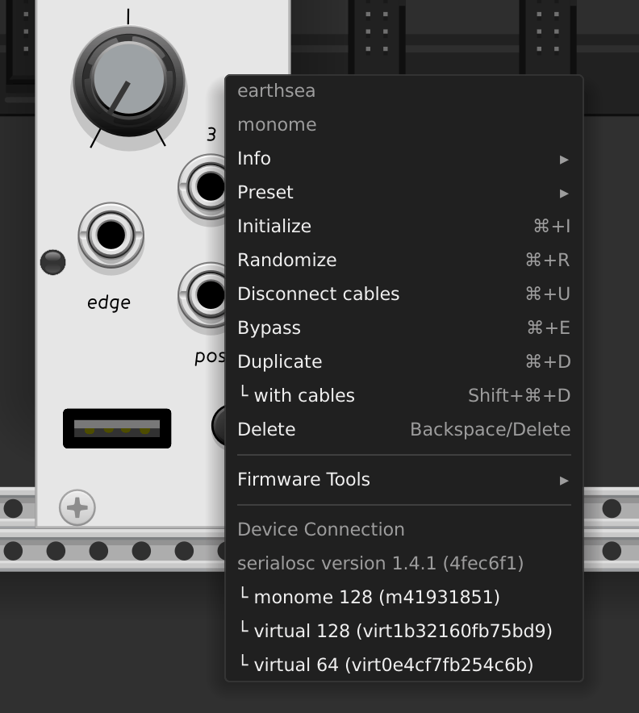
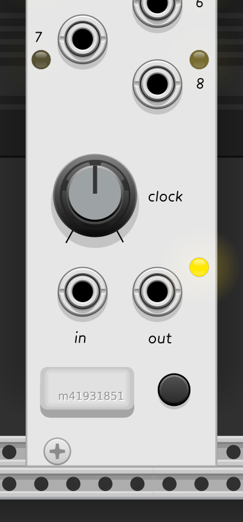

# Connecting devices

All of the modules in this plugin are designed to be used alongside with non-Eurorack control interfaces.

[Earthsea](../../modules/earthsea), [Meadowphysics](../../modules/meadowphysics), [White Whale](../../modules/whitewhale) require a [hardware grid](https://monome.org/docs/grid/) or [virtual grid](../../modules/grids) to function.

[Ansible](../../modules/ansible) requires either a grid or a [hardware arc](https://monome.org/docs/arc/) controller.

[Teletype](../../modules/teletype) uses a [computer keyboard](../../modules/teletype/#using-the-keyboard) for its primary interface, though it can also [take advantage of grids](../../modules/teletype/#teletype-and-grids). 

# Making connections

Place a grid-supporting module in your patch and right-click it. You'll see a list of hardware and virtual grids at the bottom of the menu.

{: style="width: 25em;"}

Hardware grid connections require [serialosc](https://monome.org/docs/serialosc/setup/). If serialosc is installed, the version will be shown in the menu; make sure yours is 1.4.1 or later. If serialosc is not installed, a link to install it will be shown instead.

If you don't see any connections, place a [virtual grid module](../../modules/grids) in your patch and open the menu again.

{: style="width: 12em; float: left; margin: 0em 2em 1.5em 0em;"}

Once a connection has been established, the USB port on the module will be drawn with a "wireless connection nub." (The skeuomorphism of VCV Rack requires us to invent these little fictions.)

# Restoring connections

If you connect another module to the same grid, it will be "unplugged" from the original module and the USB jack will appear empty again. To reacquire the connection, click the USB jack, and the grid will be unplugged from its current module and reassigned back to this one.

If you disconnect a hardware grid and reconnect it, the patch will remember the assignment and reconnect the grid to its last connected module, no clicks required.

If you delete a virtual grid from your patch, Undo will bring it back and restore connections. But if you don't undo, you'll have to add a new virtual grid module and connect it again from the right-click menu.

# Hardware support

Any devices that are compatible with [serialosc](https://monome.org/docs/serialosc/setup/) should work, including all editions of the [monome grid](https://monome.org/docs/grid/editions/). Devices without support for variable brightness will have a slightly different experience; some modules fall back to non-varibright support better than others.

# Tips and tricks

* The USB jack is a VCV Rack switch parameter and can be mapped to a MIDI control with [VCV MIDI-MAP](https://vcvrack.com/manual/Core#MIDI-Map) or [Stoermelder MIDI-CAT](https://github.com/stoermelder/vcvrack-packone/blob/v2/docs/MidiCat.md) in order to provide hardware control over where a grid is connected. Consult the documentation for the mapping module for detailed instructions.