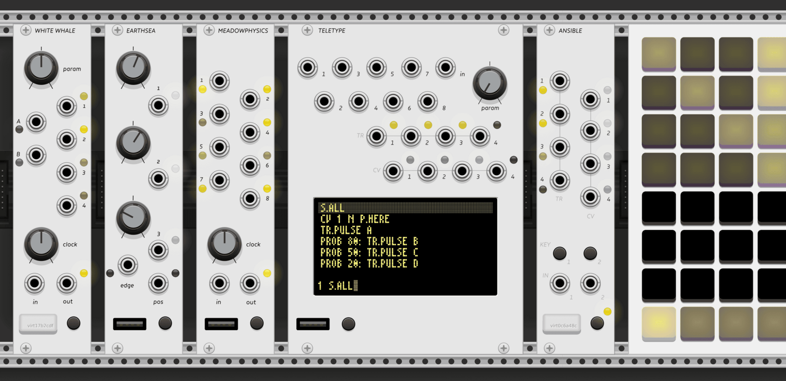

# monome for VCV Rack

This collection of modules for the [VCV Rack virtual modular synthesizer](https://vcvrack.com/rack) provides software ports of five digital hardware modules from [monome](https://monome.org).

It was made with the intention of representing the hardware versions as faithfully as possible within the constraints of the software environment.

These are deep, multi-modal sequencers and event generators. This documentation is intended as a reference and getting-started guide for using
these software ports in VCV Rack; for further study consulting the [original hardware documentation](https://monome.org/docs/) is essential.

Read the [credits](../credits).

Get the plugin from the [Releases](https://github.com/Dewb/monome-rack/releases) page or (eventually) the [VCV Rack Library](https://library.vcvrack.com/).