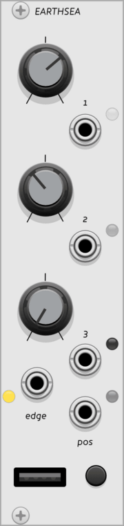

##

 <a href="modules/ansible">
  <b>Ansible</b> 
  
  </a>

 <a href="modules/earthsea">
  <b>Earthsea</b> 
  
 </a>

 <a href="modules/meadowphysics">
  <b>Meadowphysics</b> 
  
 </a>

 <a href="modules/teletype">
  <b>Teletype</b> 
  
 </a>

 <a href="modules/whitewhale">
  <b>White Whale</b> 
  
 </a>

 <a href="modules/grids">
  <b>Virtual Grids</b> 
  
 </a>

##

[Introduction to the collection](general/intro)