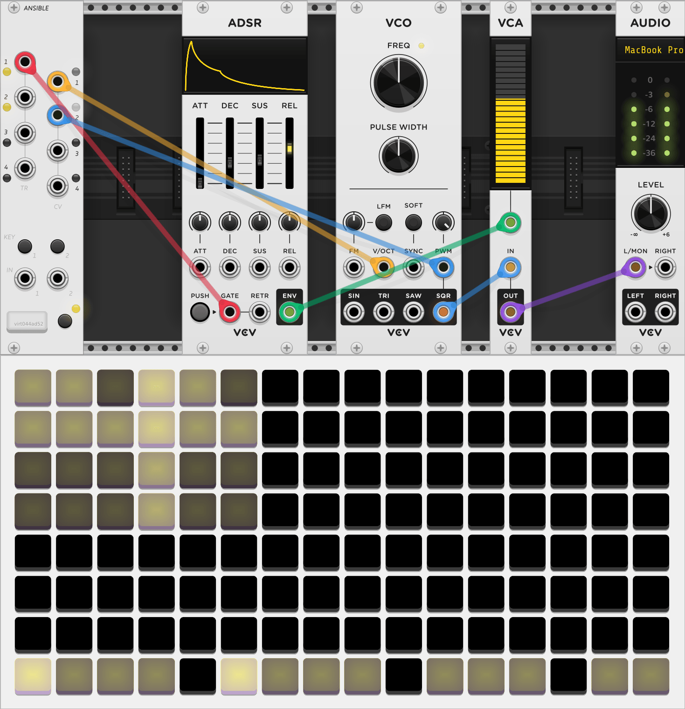
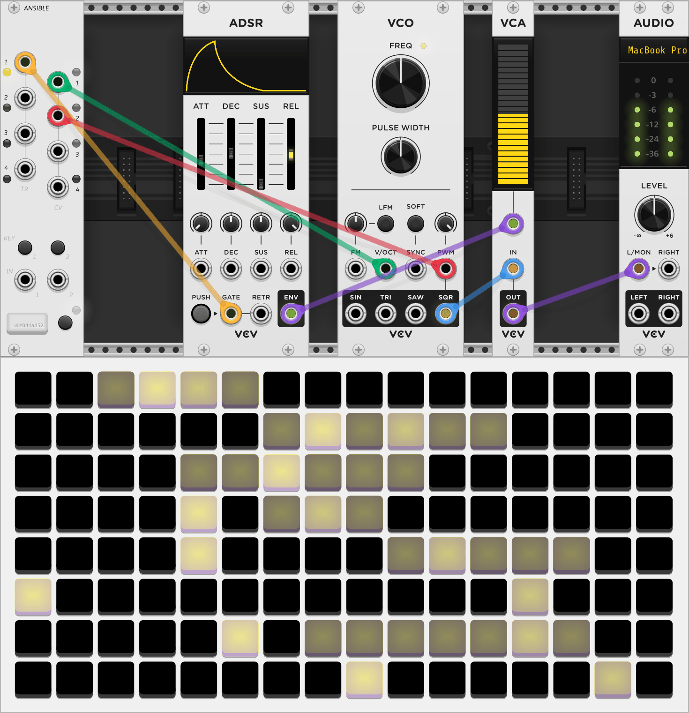
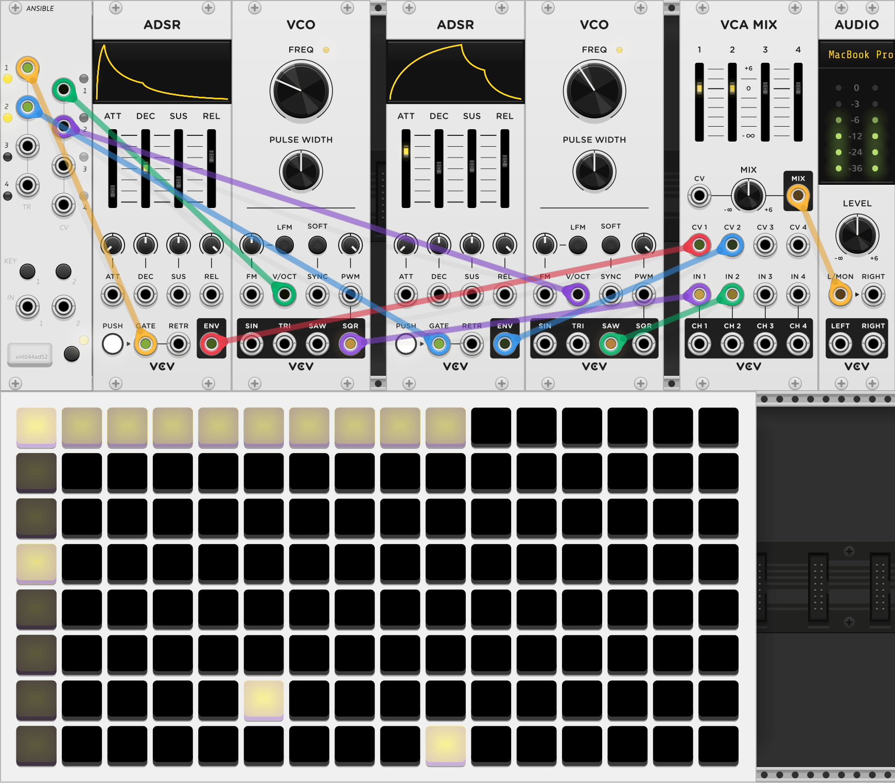
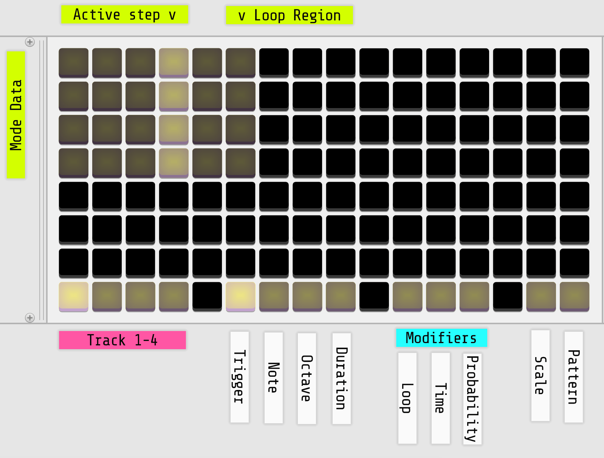

{: class="module-image-sixhp" }
## Ansible

Ansible has multiple modes that change the personality and functions of the module. To select a mode, first [connect the module](../../general/connections) to a hardware or virtual grid, or a hardware arc controller. Different modes are available depending on whether the module is connected to a grid or arc.

[Read the introduction to the hardware module](http://monome.org/docs/ansible/#basics).

Only one mode runs at a time, but you can disconnect a device and the previously active mode will continue running and responding to the panel controls and CV inputs.

The modes, each of which has its own detailed manual, are [Kria](https://monome.org/docs/ansible/kria/), [Meadowphysics](https://monome.org/docs/ansible/meadowphysics/), [Earthsea](https://monome.org/docs/ansible/earthsea/), [Cycles](https://monome.org/docs/ansible/cycles/), and [Levels](https://monome.org/docs/ansible/levels/). VCV Rack Ansible does not currently support the MIDI or Teletype Expander modes present on the hardware version.

Earthsea and Meadowphysics are similar to their standalone versions, with some key differences. Ansible Meadowphysics has the ability to produce continuous voltages instead of just gates; Ansible's version of Earthsea drops the shape memory CV feature but adds four-voice polyphony.

The bottom left key is the **MODE** key. A short press in any app will bring up the Preset view ([grid version](https://monome.org/docs/ansible/kria/#presets), [arc version](https://monome.org/docs/ansible/cycles/#presets)). A long press will rotate through the modes available with your currently connected device. The LED next to it indicates which mode is currently active:

| Mode LED color   | Grid       | Arc     |
|------------------|------------|---------|
| Yellow-orange | [Kria](https://monome.org/docs/ansible/kria/) | [Levels](https://monome.org/docs/ansible/levels/) |
| White | [Meadowphysics](https://monome.org/docs/ansible/meadowphysics/) | [Cycles](https://monome.org/docs/ansible/cycles/) |
| Yellow-white | [Earthsea](https://monome.org/docs/ansible/earthsea/) | n/a |

# Outputs

Each Ansible mode produces four trigger/gate outputs from **TR 1-4** on the left side of the module, and four CV outputs on **CV 1-4** on the right side. TR outputs are 0 V low, 8 V high, and CV outputs range from 0-10 V.

# KEY 1 & KEY 2

The two keys above the IN jacks have different functions depending on the mode and on whether you short-tap the buttons or long-hold them. To hold a button in VCV Rack using the mouse, <kbd>Ctrl-click</kbd> (<kbd>Cmd-click</kbd> on Mac) to lock them down so you can use the mouse for other things.

| mode          | KEY 1         | KEY 2                |
|---------------|--------------|---------------------|
| [Kria](https://monome.org/docs/ansible/kria/) | Time View (long) | Config View (long) |
| [Meadowphysics](https://monome.org/docs/ansible/meadowphysics/) | Time View (long) | Config View (long) |
| [Earthsea](https://monome.org/docs/ansible/earthsea/) | Previous Pattern (short) | Next Pattern (short) |
| [Cycles](https://monome.org/docs/ansible/cycles/) | Friction | Reset Pattern (short) Config View (long) |
| [Levels](https://monome.org/docs/ansible/levels/) | Next Pattern (short) Pattern View (long) Change Parameter  (short tap while in Config View) | Reset Pattern (short) Config View (long) |

# Inputs

Ansible **IN 1** and **IN 2** jacks accept trigger/gate inputs. Their function depends on the active mode:

| Mode          | IN 1         | IN 2                |
|---------------|--------------|---------------------|
| [Kria](https://monome.org/docs/ansible/kria/) | Clock | Reset |
| [Meadowphysics](https://monome.org/docs/ansible/meadowphysics/) | Clock | Reset |
| [Earthsea](https://monome.org/docs/ansible/earthsea/) | Clock | Start/reset pattern |
| [Cycles](https://monome.org/docs/ansible/cycles/) | Add friction | IN 1 unconnected: Reset IN 1 connected: Add force |
| [Levels](https://monome.org/docs/ansible/levels/) | Clock  | Reset |

# Quickstart

All of these quickstart examples use Ansible alongside modules from VCV's [Free collection](https://vcvrack.com/Free).

**Kria**

{: class="patch-image" }
*uses: Ansible, ADSR, VCA, VCO, AUDIO*

[ansible-kria-quickstart.vcv](../patches/ansible-kria-quickstart.vcv){: class="patch-download-link" }

- Connect Ansible to a grid. (See [Making Connections](../../general/connections/#making-connections).)
- The LED next to the **MODE** key should be *yellow-orange*. If it isn't, hold + release the **MODE** key to cycle through modes until Kria is active.
- Patch **TR 1** to the GATE input of ADSR.
- Patch **CV 1** to the V/OCT input of VCO.
- Patch **CV 2** to the PWM input of VCO and add modulation using the attenuator.
- Patch ADSR's ENV and VCO's SQR to a VCA, then to AUDIO's L input.
- Press some pads in Kria's top row to create a rhythm on **TR 1**.
- Switch to the NOTE page on the grid by pressing the 7th key on the bottom row, and set notes for **CV 1**.
- Switch to Track 2 on the grid by pressing the 2nd key on the bottom row, and set notes for **CV 2**'s modulation of the VCO's pulse width.
- Switch to the OCTAVE page on the grid by pressing the 8th key on the bottom row, and set different octaves for **CV 2**'s steps.

**Meadowphysics**

{: class="patch-image" }
*uses: Ansible, ADSR, VCA, VCO, AUDIO*

[ansible-meadowphysics-quickstart.vcv](../patches/ansible-meadowphysics-quickstart.vcv){: class="patch-download-link" }

- Connect Ansible to a grid. (See [Making Connections](../../general/connections/#making-connections).)
- Hold + release the **MODE** key to move from Kria to Meadowphysics. The LED next to the **MODE** key should be *white*.
- <kbd>Ctrl-Shift-click</kbd> (<kbd>Cmd-Shift-click</kbd> on Mac) **KEY 2** on Ansible's faceplate to open the [config interface](https://monome.org/docs/ansible/meadowphysics/#config).
- Set the *voice mode* to *2 CV/TR voices*.
- Patch **TR 1** to the GATE input of ADSR.
- Patch **CV 1** to the V/OCT input of VCO.
- Patch **CV 2** to the PWM input of VCO and add modulation using the attenuator.
- Patch ADSR's ENV and VCO's SQR to a VCA, then to AUDIO's L input.
- Hold down any pad outside of column 1 in any row and press another pad in the same row to create a [count range](https://monome.org/docs/ansible/meadowphysics/#basic) -- if you're using a virtual grid, <kbd>Ctrl-click</kbd> (<kbd>Cmd-click</kbd> on Mac) will hold a pressed pad until you release <kbd>Ctrl</kbd> / <kbd>Cmd</kbd>.

**Earthsea**

{: class="patch-image" }
*uses: Ansible, ADSR (2x), VCO (2x), VCA MIX, AUDIO*

[ansible-earthsea-quickstart.vcv](../patches/ansible-earthsea-quickstart.vcv){: class="patch-download-link" }

- Connect Ansible to a grid. (See [Making Connections](../../general/connections/#making-connections).)
- Hold + release the **MODE** key to move from Kria to Meadowphysics and then Earthsea.  The LED next to the **MODE** key should be *yellow-white*.
- Hold the bottom-left pad on the grid to enter the [voice allocation interface](https://monome.org/docs/ansible/earthsea/#voice-allocation) and set the first two outputs to active on both *pattern* and *live*.
- Instantiate two ADSR and two VCO modules.
- Set one of the VCO's FREQ to 1/2 the FREQ of the other.
- Patch **TR 1** and **TR 2** to the GATE input of each ADSR.
- Patch **CV 1** and **CV 2** to the V/OCT input of each VCO.
- Patch one output of each VCO to the first two inputs of VCA MIX.
- Patch each ADSR's ENV output to the corresponding CV inputs of VCA MIX.
- Patch the VCA MIX's MIX output to AUDIO's L input.
- [Arm a pattern recorder](https://monome.org/docs/ansible/earthsea/#pattern-recording) by pressing the key in the third row of the leftmost column.
- Record some chord shapes on the grid. Hit the pattern record arm key again to stop recording and play the pattern back.

# Grid reference

When using Kria, the bottom row of the grid controls the track/mode/view, and is consistent across modes (with a couple of exceptions.) The rest of the grid contents depend on the mode you're in. See [the hardware documentation](https://monome.org/docs/ansible/kria/) for more details.

{: class="patch-image" }

[ansible-kria-grid-legend.vcv](../patches/ansible-kria-grid-legend.vcv){: class="patch-download-link" } *(requires [Stoermelder Glue](https://library.vcvrack.com/Stoermelder-P1))*

For Meadowphysics, see the [grid legends for standalone Meadowphysics](../meadowphysics/#grid-reference).

For Earthsea, see the [grid legend for standalone Earthsea](../earthsea/#grid-reference). Ansible Earthsea is identical except the last two functions, Slew and Portamento, are replaced by the [Runes](https://monome.org/docs/ansible/earthsea/#runes) and [Voice Allocation](https://monome.org/docs/ansible/earthsea/#voice-allocation) screens.

# Further reading

* Ansible [hardware documentation](http://monome.org/docs/ansible/)
* [Kria tutorial](https://llllllll.co/t/monome-ansible-kria-in-depth-overview-and-tutorial/34821) by [Puscha](https://puscha.bandcamp.com/)
* [Kria strategies](https://llllllll.co/t/kria-strategies/17671)
* ["ansible" search on llllllll.co](https://llllllll.co/search?q=ansible)