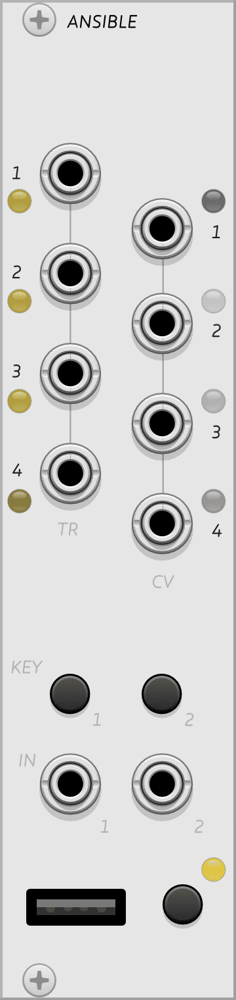

{: style="float: left; margin: 0em 2em 1.5em 0em; width: 9.5em; height: auto;"}
## Ansible

Ansible has multiple modes that change the personality and functions of the module. To select a mode, first [connect the module](../../general/connections) to a hardware or virtual grid, or a hardware arc controller. Different modes are available depending on whether the module is connected to a grid or arc.

[Read the introduction to the hardware module](http://monome.org/docs/ansible/#basics).

Only one mode runs at a time, but you can disconnect a device and the previously active mode will continue running and responding to the panel controls and CV inputs.

The modes, each of which has its own detailed manual, are [Kria](https://monome.org/docs/ansible/kria/), [Meadowphysics](https://monome.org/docs/ansible/meadowphysics/), [Earthsea](https://monome.org/docs/ansible/earthsea/), [Cycles](https://monome.org/docs/ansible/cycles/), and [Levels](https://monome.org/docs/ansible/levels/). VCV Rack Ansible does not currently support the MIDI or Teletype Expander modes present on the hardware version.

Earthsea and Meadowphysics are similar to their standalone versions, with some key differences. Ansible Meadowphysics has the ability to produce continuous voltages instead of just gates; Ansible's version of Earthsea drops the shape memory CV feature but adds four-voice polyphony.

The bottom left key is the **MODE** key. A short press in any app will bring up the Preset view ([grid version](https://monome.org/docs/ansible/kria/#presets), [arc version](https://monome.org/docs/ansible/cycles/#presets)). A long press will rotate through the modes available with your currently connected device. The LED next to it indicates which mode is currently active:

| Mode LED color   | Grid       | Arc     |
|------------------|------------|---------|
| Yellow-orange | [Kria](https://monome.org/docs/ansible/kria/) | [Levels](https://monome.org/docs/ansible/levels/) |
| White | [Meadowphysics](https://monome.org/docs/ansible/meadowphysics/) | [Cycles](https://monome.org/docs/ansible/cycles/) |
| Yellow-white | [Earthsea](https://monome.org/docs/ansible/earthsea/) | n/a |

# Outputs

Ansible modes all produce four trigger/gate outputs from **TR 1-4** on the left side of the module, and four CV outputs on **CV 1-4** on the right side. TR outputs are 0 V low, 8 V high, and CV outputs range from 0-10 V.

# KEY 1 & KEY 2

The two keys above the IN jacks have different functions depending on the mode and on whether you short-tap the buttons or long-hold them. To hold a button in VCV Rack using the mouse, Ctrl-click (Cmd-click on Mac) to lock them down so you can use the mouse for other things.

| mode          | KEY 1         | KEY 2                |
|---------------|--------------|---------------------|
| [Kria](https://monome.org/docs/ansible/kria/) | Time View (long) | Config View (long) |
| [Meadowphysics](https://monome.org/docs/ansible/meadowphysics/) | Time View (long) | Config View (long) |
| [Earthsea](https://monome.org/docs/ansible/earthsea/) | Previous Pattern (short) | Next Pattern (short) |
| [Cycles](https://monome.org/docs/ansible/cycles/) | Friction | Reset Pattern (short) Config View (long) |
| [Levels](https://monome.org/docs/ansible/levels/) | Next Pattern (short) Pattern View (long) Change Parameter  (short tap while in Config View) | Reset Pattern (short) Config View (long) |

# Inputs

Ansible **IN 1** and **IN 2** jacks accept trigger/gate inputs. Their function depends on the active mode:

| Mode          | IN 1         | IN 2                |
|---------------|--------------|---------------------|
| [Kria](https://monome.org/docs/ansible/kria/) | Clock | Reset |
| [Meadowphysics](https://monome.org/docs/ansible/meadowphysics/) | Clock | Reset |
| [Earthsea](https://monome.org/docs/ansible/earthsea/) | Clock | Start/reset pattern |
| [Cycles](https://monome.org/docs/ansible/cycles/) | Add friction | IN 1 unconnected: Reset IN 1 connected: Add force |
| [Levels](https://monome.org/docs/ansible/levels/) | Clock  | Reset |

# Quickstart

...

# Further reading

* Ansible [hardware documentation](http://monome.org/docs/ansible/)
* [kria tutorial](https://llllllll.co/t/monome-ansible-kria-in-depth-overview-and-tutorial/34821) by [Puscha](https://puscha.bandcamp.com/)
* [kria strategies](https://llllllll.co/t/kria-strategies/17671)
* ["ansible" search on llllllll.co](https://llllllll.co/search?q=ansible)