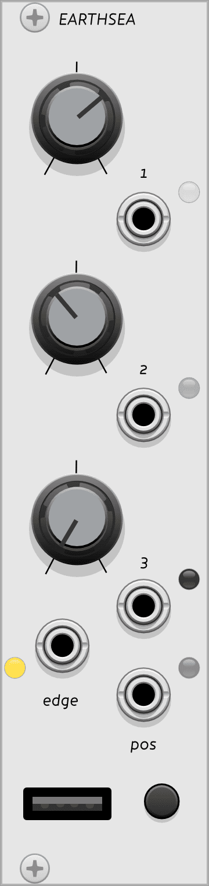

{: style="float: left; margin: 0em 2em 1.5em 0em; width: 9.5em; height: auto;"}

## Earthsea

Earthsea, [connected to a grid controller](../../general/connections), is an isomorphic keyboard and sequencer. 

Without a grid connection it will not produce any output, but once a sequence has been played and recorded, you can disconnect the grid and the sequence will continue playing.

[Read the introduction to the hardware module](http://monome.org/docs/earthsea/#introduction).

# CV 1-3 knobs and outputs

The **CV 1-3** jacks each output a 0-10 V signal that is initially controlled by the paired knob. When using a [shape memory gesture](https://monome.org/docs/earthsea/#shape-memories) on the grid, the previously stored CV values will be recalled, subject to the [slew settings](https://monome.org/docs/earthsea/#shape-memories). These values are also displayed on the bottom three rows of a connected grid.

# EDGE and POS outputs

**EDGE** produces an 8 V gate when a note event is triggered, either by playing the keyboard or playing back a sequence.
**POS** outputs a pitch CV from 0-10 V corresponding to the scale position of the note being played.

# Inputs

Earthsea does not have any inputs.

# Quickstart

...

# Further reading

* Earthsea [hardware documentation](http://monome.org/docs/earthsea/)
* ["earthsea" search on llllllll.co](https://llllllll.co/search?q=earthsea)

# Video tutorials

* [earthsea introduction](https://vimeo.com/113231441)
