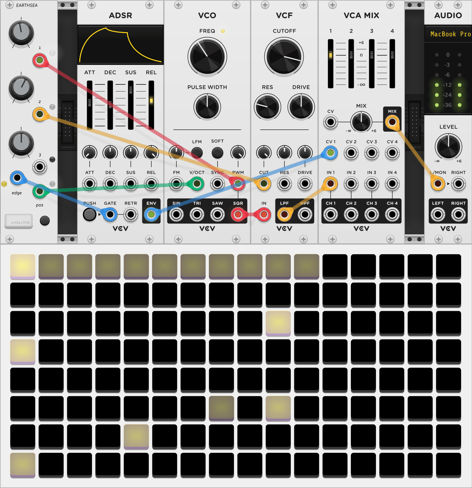

{: class="module-image-sixhp" }
## Earthsea

Earthsea, [connected to a grid controller](../../general/connections), is an isomorphic keyboard and sequencer. 

Without a grid connection it will not produce any output, but once a sequence has been played and recorded, you can disconnect the grid and the sequence will continue playing.

[Read the introduction to the hardware module](http://monome.org/docs/earthsea/#introduction).

# CV 1-3 knobs and outputs

The **CV 1-3** jacks each output a 0 V to 10 V signal that is initially controlled by the paired knob. When using a [shape memory gesture](https://monome.org/docs/earthsea/#shape-memories) on the grid, the previously stored CV values will be recalled, subject to the [slew settings](https://monome.org/docs/earthsea/#shape-memories). These values are also displayed on the bottom three rows of a connected grid.

# EDGE and POS outputs

**EDGE** produces an 8 V gate when a note event is triggered, either by playing the keyboard or playing back a sequence.  
**POS** outputs a pitch CV from 0 V to 10 V corresponding to the scale position of the note being played.

# Inputs

Earthsea does not have any inputs.

# Quickstart
This quickstart example uses Earthsea alongside modules from VCV's [Fundamental collection](https://vcvrack.com/Fundamental).

{: style="width: 40em;"}
*uses: Earthsea, ADSR, VCO, VCF, VCA MIX, AUDIO*

- Connect Earthsea to a grid
- Patch Earthsea's **EDGE** to ADSR's GATE input
- Patch Earthsea's  **POS** to VCO's V/OCT input
- Patch VCO's SQR output to VCF's IN
- Patch VCF's LPF output to IN 1 of VCA MIX
- Patch ADSR's ENV output to CV 1 of VCA MIX
- Patch VCA MIX's MIX output to AUDIO's L input
- Patch Earthsea's **CV 1** to the PWM input of VCO and add modulation using the attenuator above the input
- Patch Earthsea's **CV 2** to the CUT input of VCF and add modulation using the attenuator above the input
- [Arm a pattern recorder](https://monome.org/docs/earthsea/#patterns), record a melody on the grid, and play the pattern back
- Add voltage to Earthsea's **CV 1** and **CV 2** and perform a [triples shape-memory](https://monome.org/docs/earthsea/#shape-memories) to store it
- Repeat the previous step for additional values and **triples** *shape-memories*
- As the pattern plays, switch between *shape-memories*
- [Add slew to each shape-memory](https://monome.org/docs/earthsea/#slew)

# Further reading

* Earthsea [hardware documentation](http://monome.org/docs/earthsea/)
* ["earthsea" search on llllllll.co](https://llllllll.co/search?q=earthsea)

# Video tutorials

* [Earthsea introduction](https://vimeo.com/113231441)
