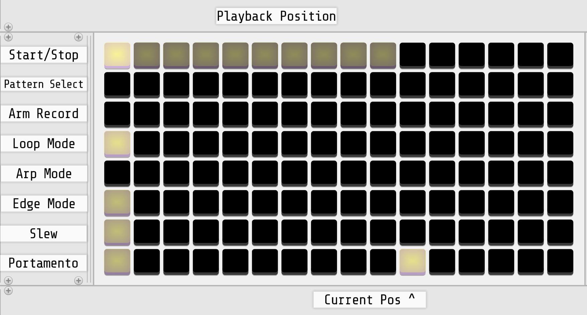

{: class="module-image-sixhp" }
## Earthsea

Earthsea, [connected to a grid controller](../../general/connections), is an isomorphic keyboard and sequencer. 

Without a grid connection it will not produce any output, but once a sequence has been played and recorded, you can disconnect the grid and the sequence will continue playing.

[Read the introduction to the hardware module](http://monome.org/docs/earthsea/#introduction).

# CV 1-3 knobs and outputs

The **CV 1-3** jacks each output a 0 V to 10 V signal that is initially controlled by the paired knob. When using a [shape memory gesture](https://monome.org/docs/earthsea/#shape-memories) on the grid, the previously stored CV values will be recalled, subject to the [slew settings](https://monome.org/docs/earthsea/#slew). These values are also displayed on the bottom three rows of a connected grid.

# EDGE and POS outputs

**EDGE** produces an 8 V gate when a note event is triggered, either by playing the keyboard or playing back a sequence.  
**POS** outputs a pitch CV from 0 V to 10 V corresponding to the scale position of the note being played.

# Inputs

Earthsea does not have any inputs.

# Grid reference

Earthsea uses the leftmost column for mode controls, leaving the entire rest of the grid as a playing surface (called the *keymap*.) Notes in the keymap are arranged by semitones on the x-axis and by fourths on the y-axis. The most recently played key is highlighted; the pitch of this key will be present on the *POS* output in V/oct format.

Various forms of information are shown on the grid as horizontal bars underneath the keymap. When the sequencer is playing, the top row will display the progress of the loop. The bottom three rows show the current value of CV 1-3.

{: class="patch-image" }

[earthsea-grid-legend.vcv](../patches/earthsea-grid-legend.vcv){: class="patch-download-link" } *(requires [Stoermelder Glue](https://library.vcvrack.com/Stoermelder-P1))*

# Quickstart

This quickstart example uses Earthsea alongside modules from VCV's [Free collection](https://vcvrack.com/Free).

{: class="patch-image" }
*uses: Earthsea, ADSR, VCO, VCF, VCA MIX, AUDIO*

[earthsea-quickstart.vcv](../patches/earthsea-quickstart.vcv){: class="patch-download-link" }

- Connect Earthsea to a grid. (See [Making Connections](../../general/connections/#making-connections).)
- Patch Earthsea's **EDGE** output to ADSR's GATE input.
- Patch Earthsea's  **POS** output to VCO's V/OCT input.
- Patch VCO's SQR output to VCF's IN.
- Patch VCF's LPF output to IN 1 of VCA MIX.
- Patch ADSR's ENV output to CV 1 of VCA MIX.
- Patch VCA MIX's MIX output to AUDIO's L input.
- Patch Earthsea's **CV 1** output to the PWM input of VCO and add modulation using the attenuator above the input.
- Patch Earthsea's **CV 2** output to the CUT input of VCF and add modulation using the attenuator above the input.
- [Arm a pattern recorder](https://monome.org/docs/earthsea/#patterns) by pressing the key in the third row of the first column. Record a melody by pressing keys on the grid in columns 2-16. Hit the third key in the first column again to start playing the pattern back.

If you have a hardware grid and can make simultaneous multi-finger gestures, you can try the shape memory feature:

- Add voltage to Earthsea's **CV 1** and **CV 2** by turning their knobs clockwise, and perform a [shape-memory gesture](https://monome.org/docs/earthsea/#shape-memories) to store those settings and start editing the new shape.
- Repeat the previous step for additional values and **triples** *shape-memories*.
- As the pattern plays, switch between *shape-memories*.
- [Add slew to a shape memory CV channel](https://monome.org/docs/earthsea/#slew) by holding down the 7th key in the first column and turning the CV 1 knob.

# Further reading

* Earthsea [hardware documentation](http://monome.org/docs/earthsea/)
* ["earthsea" search on llllllll.co](https://llllllll.co/search?q=earthsea)

# Video tutorials

* [Earthsea introduction](https://vimeo.com/113231441)
