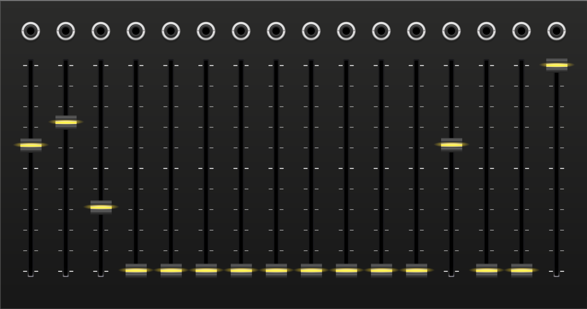
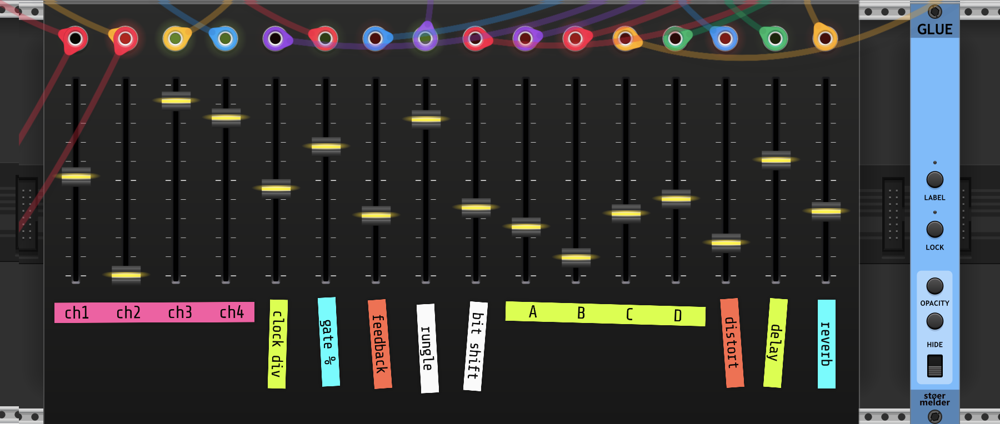

##

{: class="module-image-eighteenhp" }

## Faderbank

The faderbank module is a virtual control surface inspired by the open source [16n-faderbank hardware controller](https://16n-faderbank.github.io). The 16n was developed by Brian Crabtree, Sean Hellfritsch, Tom Armitage, and Brendon Cassidy.

At heart it's simple: sixteen faders, with 16 CV outputs. Output ranges are selectable from 0-10V, 0-5V, or +/-5V from the right-click menu.

This virtual version has two reasons for existing: to provide extra parameter inputs as an expander to Teletype, and to make it easy to use the 16n-faderbank and compatible hardware with VCV Rack.

# Using with 16n hardware

Plug in your faderbank via USB. Right-click the module and hover over the **MIDI connection** submenu. Select your driver and the 16n device. 

If your 16n is set to use the default CC and channel mappings (CCs 32-47 on channel 1) then you're all set.

If your 16n has a custom configuration, right-click the module again and select the **Autodetect 16n configuration** command. Rack will interrogate the 16n via sysex and configure the virtual faders to respond to the configured MIDI events.

This command also has the side effect of requesting a CC update from every fader, so you can use it to bring the virtual and hardware faders back in sync after the controller has been disconnected.

If you are not connected to a device that responds to 16n sysex, then **Autodetect 16n configuration** will reset the MIDI mapping to the default (CCs 32-47 on channel 1.)

# Using with non-16n hardware

You can also use the module with another MIDI controller. If you can configure your MIDI controller to use CC numbers 32-47 on channel 1, then you can connect it via the right-click menu on the module just like a 16n.

If you cannot configure your MIDI controller to use CC 32-47, then you can map the faders individually the normal way using the VCV Core [MIDI-Map](https://vcvrack.com/manual/Core#MIDI-Map) module.

# Using with Teletype

When a faderbank is placed immediately next to Teletype, it serves as a param expander. The fader values (0-16383) are available with the `FADER` op (or `FB` for short.) The voltage range option has no effect on the digital values seen by Teletype.

`FADER.SCALE` is also helpful -- see the [teletype manual](https://monome.org/docs/teletype/manual/#n) for more details on using the faderbank OPs.

Teletype 4.0 only supports a single faderbank (faders 1-16). Teletype 5.0 supports up to four separate devices (faders 1-64). 

Multiple connected faderbanks are addressed in order from left to right, on either side of Teletype. If you have more than four in a row, the fifth and subsequent faderbank modules will be ignored. If more than one Teletype module adjoins a set of adjacent faderbanks, the fader values will be available to both Teletype instances.

For example, here's a script to copy values from two faderbanks into slots 0-15 of tracker patterns 0 and 1. Put this in `M` and set `M 20` in LIVE mode.

```
L 0 15: PN 0 I FB + I 1
L 0 15: PN 1 I FB + I 17
```

# Using with Stoermelder Glue

Right click the module and change **Fader length** to 60mm in order to free up some space for resting your wrists, and/or for applying labels using [Stoermelder Glue](https://library.vcvrack.com/Stoermelder-P1/Glue), so you don't forget what the faders are connected to.



# Polyphonic mode

Right-click the module and check **Polyphonic mode** to convert the #16 output into a polyphonic output that contains all 16 fader voltages on one cable.

# Further reading

* [16n-faderbank website](https://16n-faderbank.github.io)
* [16n-faderbank GitHub repository](https://github.com/16n-faderbank/16n)
* [16n is a bank of faders](https://llllllll.co/t/16n-is-a-bank-of-faders-release-thread/18620) lines thread
* ["16n" search on llllllll.co](https://llllllll.co/search?q=16n)
