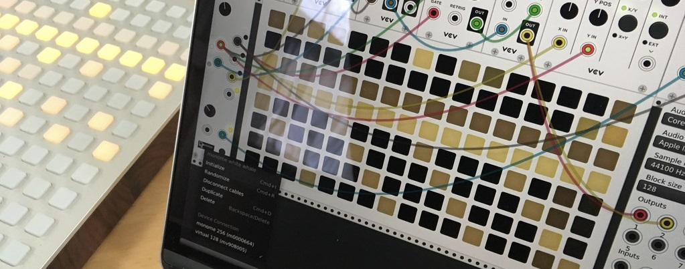
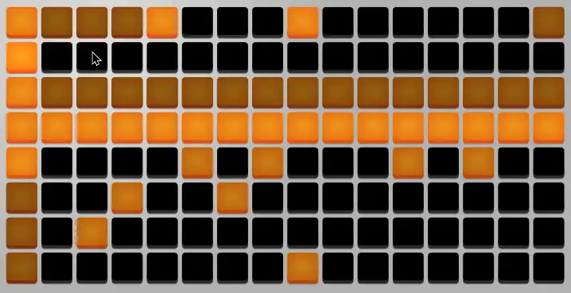
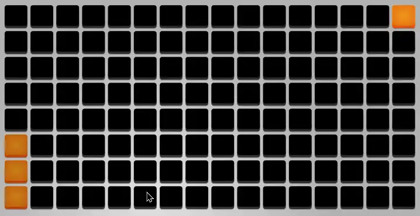
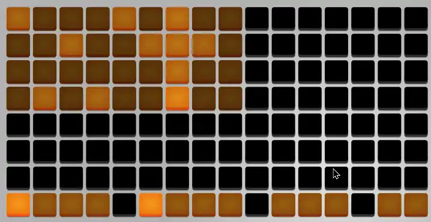

# Virtual grids

# Sizes

Virtual grids come in 64 (8x8), 128 (16x8), and 256 (16x16) key flavors. Most modules and modes are designed for the 128-key version, though all will work with every size; some features may not be available or might not work exactly the same way on the other sizes.

# Limitations vs. hardware

The virtual grids are something of a compromise. They're never going to be as performable or tactile as a physical controller. 

Using all features of these grid-supporting modules relies on gestures intended to be performed with two hands. Unfortunately, VCV Rack doesn't currently support multi-touch, so with a mouse alone you can only press one key at a time.

However, using the mouse and computer keyboard together, we can approximate some multi-handed gestures.

# Holding keys

To compensate for only having one pointer finger instead of ten, you can <kbd>Ctrl-click</kbd> keys (or <kbd>Cmd-click</kbd> on Mac) to hold them down momentarily. You can hold multiple grid keys while you hold down <kbd>Ctrl</kbd> (or <kbd>Cmd</kbd>) and all the held grid keys will be released when you stop holding it.

This is handy for typical gestures like [setting the loop length on White Whale](http://monome.org/docs/whitewhale/#position--clock). <kbd>Ctrl-click</kbd> a key in row 2 to set the loop start, and then while still holding <kbd>Ctrl</kbd>, click another key in row 2 to set the end point.

{: }

# Locking keys

Sometimes you need to hold a key down for a longer period of time. <kbd>Ctrl-Shift-click</kbd> a grid key (<kbd>Cmd-Shift-click</kbd> on Mac) to "lock" it down until you click it again. If you lock multiple keys, you can release them all at once by hitting <kbd>Esc</kbd> while hovering over the grid, or selecting **Release Locked Keys** from the right-click menu.

Locked keys are indicated by a dot in the lower left corner. 

Locking a key allows you to use mode/settings pages, where you might need to hold a key down while pressing several other keys. For example, to enter [Edge Mode](http://monome.org/docs/earthsea/#edge) on [Earthsea](../modules/earthsea), <kbd>Ctrl-Shift-click</kbd> the 6th key in the first column to enter the mode, and then click the glyphs to change the gate method and time. Click the locked key again to unlock it and return to the main mode.

{: }

# Combining gestures

Locking and holding keys can work together. For example, to adjust loop length in Kria, <kbd>Ctrl-Shift-click</kbd> the [Loop Modifier key](https://monome.org/docs/ansible/kria/#modifiers) in row 8 to edit loop lengths, then <kbd>Ctrl-click</kbd> the start and end of the loop in rows 1-4.

{: style="border-right: 0.2em solid #bfbfbf; border-bottom: 0.1em solid #bfbfbf;" }

# Theme and protocol options

From the right-click menu, you can change the *Theme* of a individual grid instance to differentiate it from other grids in your patch, or just for personal style preference. The four themes are *loosely* based on the various eras of grid controller hardware. They don't have identical brightness curves and some themes may be more satisfying than others for certain modules and modes.

There is also a menu option to change the protocol the grid is simulating. This might be useful if you have an older-protocol hardware grid and you want to practice with the same non-varibright behavior on a virtual grid, or if you are developing new module firmware and want to test against older, non-varibright grids. Most users should leave this set to *Mext (varibright)*.

