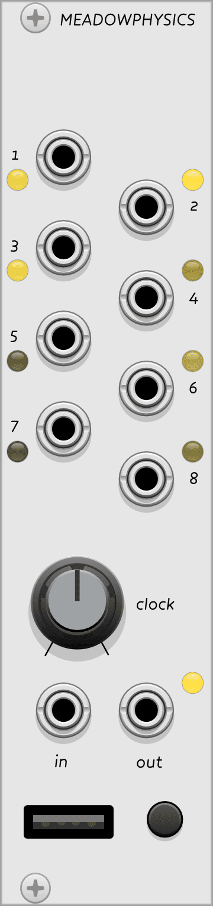

{: style="float: left; margin: 0em 2em 1.5em 0em; width: 9.5em; height: auto;"}
## Meadowphysics

Meadowphysics generates 8 interrelated gate sequences. Without a grid connected, it will output 8 gate sequences driven by the CLOCK knob or the external clock patched to the clock input. With a [grid connected](../../general/connections), the individual timing, rules, and complex triggering conditions of the sequences can be manipulated.

[Read the introduction to the hardware module](http://monome.org/docs/meadowphysics/#introduction).

# Main outputs

Outputs 1-8 produce gates at 8 V according to the counters on rows 1-8 of the grid. Outputs follow the pulse length of the clock; the built-in clock has a 50% duty cycle.

# CLOCK knob & jacks

The **CLOCK** knob controls the timing of clock pulses that drive the counters. The knob ranges from a period of 1 second to a period of 23ms. Patching a signal into **CLOCK IN** will override the timing and [every low/high transition](../../general/voltage/#inputs) on the input will pulse the counters. (Very fast clocks < 10ms may result in skipped pulses; the module will not go into audio rate.) 

When an external clock is patched, the knob becomes a clock divider/multiplier, from a 1/16 division to a 16x multiplier. **CLOCK OUT** outputs the internal clock when it is active or external clock, post division/multiplication, if one is patched.

# PRESET key

VCV Rack will remember the current working memory in your patch, but the **PRESET** key can be used to store and recall 16 different states to the module's "internal memory." Press and hold to quicksave the current state to the active slot, or short-press to [enter Preset mode](http://monome.org/docs/meadowphysics/#preset).

# Quickstart

...

# Further reading

* Meadowphysics [hardware documentation](http://monome.org/docs/meadowphysics/)
* ["meadowphysics" search on llllllll.co](https://llllllll.co/search?q=meadowphysics)

# Video tutorials

* [meadowphysics possibilities](https://vimeo.com/107582557)
* [meadowphysics tutorial](https://vimeo.com/107586549)
* [meadowphysics two](https://vimeo.com/146731772)