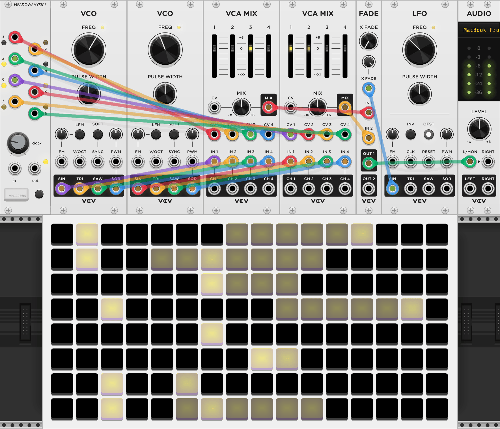
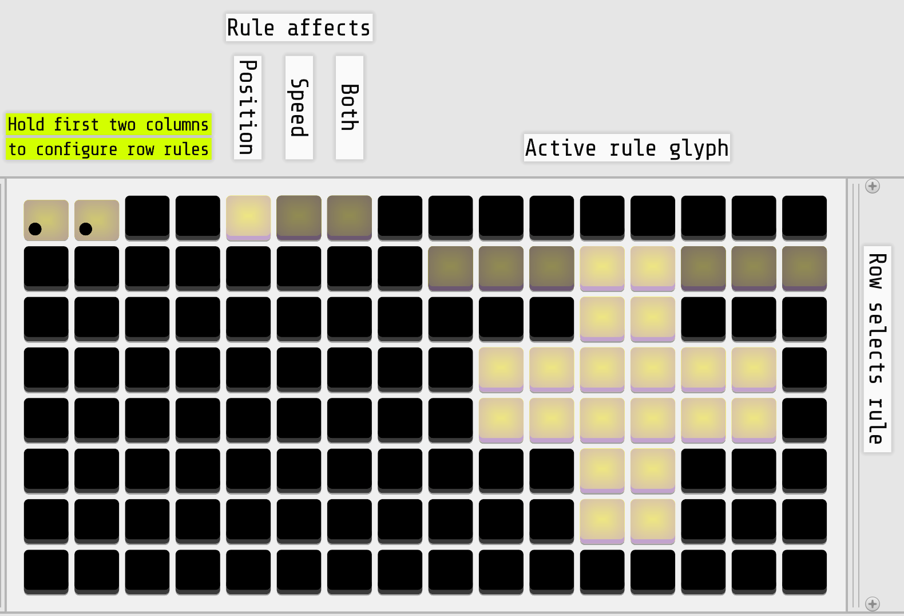

{: class="module-image-sixhp" }
## Meadowphysics

Meadowphysics generates eight interrelated gate sequences. Without a grid connected, it will output eight gate sequences driven by the CLOCK knob or the external clock patched to the clock input. With a [grid connected](../../general/connections), the individual timing, rules, and complex triggering conditions of the sequences can be manipulated.

[Read the introduction to the hardware module](http://monome.org/docs/meadowphysics/#introduction).

The trigger outputs from Meadowphysics are suitable for firing off ADSR envelopes, pinging LPGs or filters, clocking or resetting sequencers, triggering drum modules or samplers, or whatever complex events you have in your patch. Meadowphysics was originally designed as a script-triggering companion to [Teletype](../teletype), so try using them together once you're familiar with both.

# Main outputs

Outputs 1-8 produce gates at 8 V according to the counters on rows 1-8 of the grid. Outputs follow the pulse length of the clock; the built-in clock has a 50% duty cycle.

# CLOCK knob & jacks

The **CLOCK** knob controls the timing of clock pulses that drive the counters. The knob ranges from a period of 1 second to a period of 23ms. Patching a signal into **CLOCK IN** will override the timing and [every low/high transition](../../general/voltage/#inputs) on the input will pulse the counters. Very fast clocks approaching a 1ms period may result in skipped pulses; the module will not go into audio rate.

When an external clock is patched, the knob becomes a clock divider/multiplier, from a 1/16 division to a 16x multiplier. **CLOCK OUT** outputs the internal clock when it is active or external clock, post division/multiplication, if one is patched.

# PRESET key

VCV Rack will remember the current working memory in your patch, but the **PRESET** key can be used to store and recall 16 different states to the module's "internal memory." Press and hold to quicksave the current state to the active slot, or short-press to [enter Preset mode](http://monome.org/docs/meadowphysics/#preset).

# Quickstart

This quickstart example uses Meadowphysics alongside modules from VCV's [Free collection](https://vcvrack.com/Free). 

{: class="patch-image" }
*uses: Meadowphysics, VCO (2x), VCA MIX (2x), FADE, LFO, AUDIO*

[meadowphysics-quickstart.vcv](../patches/meadowphysics-quickstart.vcv){: class="patch-download-link" }

- Connect Meadowphysics to a grid
- Patch the four outputs of each VCO to the four inputs of each ADSR
- Patch the eight **TR** outputs of Meadowphysics to the CV inputs of each ADSR
- Patch the MIX outputs of each ADSR to the inputs of FADE
- Patch any LFO output to FADE's X FADE input and add modulation using the Crossfade CV attenuator above
- Patch the output of FADE to the L/MON input of AUDIO
- To set a different count for each row, press any pad beyond the first column in that row
- Hold down any pad outside of column 1 in any row and press another pad in the same row to create a [count range](https://monome.org/docs/ansible/meadowphysics/#basic)
- Change the [rule](https://monome.org/docs/meadowphysics/#rules--ranges) for each range

# Grid reference

{: class="patch-image" }
{: class="patch-image" }
{: class="patch-image" }

[meadowphysics-grid-legends.vcv](../patches/meadowphysics-grid-legends.vcv){: class="patch-download-link" } *(requires [Stoermelder Glue](https://library.vcvrack.com/Stoermelder-P1))*

# Further reading

* Meadowphysics [hardware documentation](http://monome.org/docs/meadowphysics/)
* ["meadowphysics" search on llllllll.co](https://llllllll.co/search?q=meadowphysics)

# Video tutorials

* [meadowphysics possibilities](https://vimeo.com/107582557)
* [meadowphysics tutorial](https://vimeo.com/107586549)
* [meadowphysics two](https://vimeo.com/146731772)