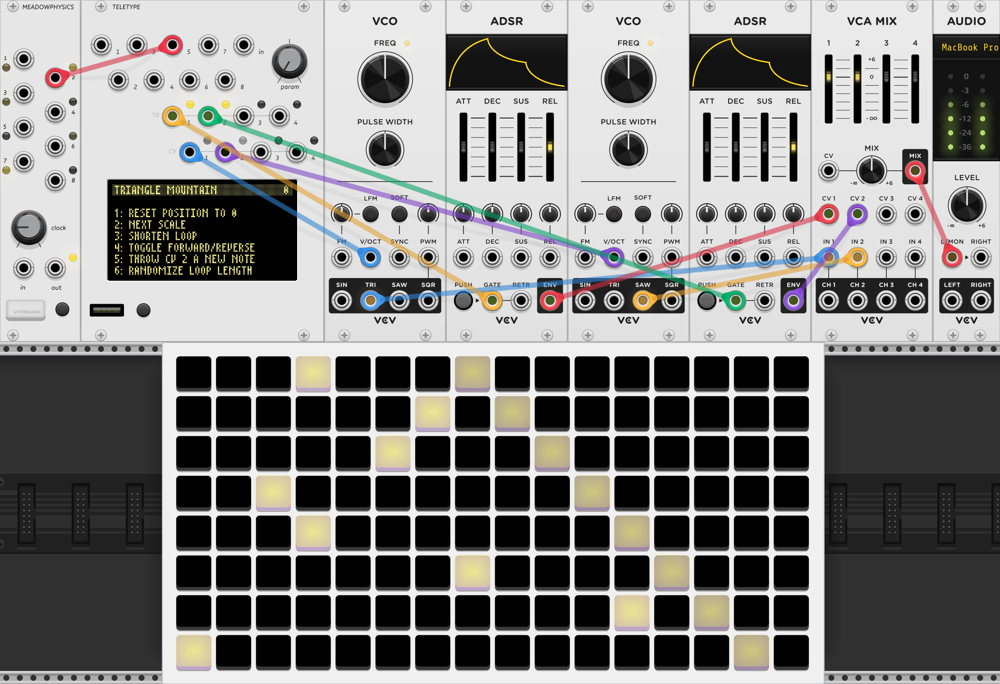

##

{: class="module-image-eighteenhp" }

## Teletype

Teletype is a generative scripting system and sequencing toolkit designed for livecoding and musical exploration. It can serve lots of roles in a patch including a simple tracker-style sequencer, a random gate processor, or a development platform for complex grid-enabled applications. It can be the brain of your entire patch, or it can just provide some custom utility glue.

# Modes, Scripts, and OPs

Teletype has three main modes: [LIVE](http://monome.org/docs/teletype/manual/#live-mode) mode, where commands are executed immediately, [EDIT](http://monome.org/docs/teletype/manual/#edit-mode) mode, where code is assembled into stored scripts, and [TRACKER](http://monome.org/docs/teletype/manual/#patterns) mode, where pattern data can be edited visually. Pressing the **TAB** key will cycle between these three main modes. 

Scripts can be simple or intricate, but there are just ten of them, and each one is only six lines long. Scripts `1-8` are triggered by the eight trigger inputs. The ninth script, `M` for metronome, is triggered by the internal clock, and the tenth `I` script runs when a preset is loaded. Scripts can also be triggered by **F1-F10** on the keyboard, or with a connected grid. Scripts can also trigger other scripts with the `SCRIPT n` operator.

Scripts are made up of operators or [OPs](http://monome.org/docs/teletype/manual/#ops-and-mods). *OPs* may have one or more arguments that could be  numbers or the outputs of other OPs. OPs and values are combined in [prefix notation](https://en.wikipedia.org/wiki/Polish_notation). Hit **Alt-H** (**Option-H** on Mac) on the keyboard to enter **HELP** mode, an on-device reference for OPs and their arguments.

# Using the keyboard

To send keyboard input to Teletype, click the screen with your mouse or trackpad. A highlight ring will be drawn around the screen to indicate keyboard focus. Keystrokes will go into Teletype instead of Rack until you click away to un-focus the screen. 

Note that your operating system may intercept some keyboard combinations (like **Alt-Esc** to enter **SCENE WRITE** mode). If that happens, **Alt-Esc** and other critical key combinations can also be triggered via the right-click menu.

The VCV Rack version of Teletype defers keycode processing to the firmware, so unfortunately, like the hardware, it currently only supports US QWERTY keyboard layouts. 

# TRIGGER inputs

Each trigger input **1-8** across the top of the module corresponds to scripts `1-8`. These respond to rising edges of voltage greater than ~2.21 V

# IN jack & PARAM knob

The **IN** jack and **PARAM** knob can be used to set and replace values. Each returns a value in the range 0-16383, representing 0 V to 10 V. See [the Teletype manual](https://monome.org/docs/teletype/manual/#hardware/) for more information.

The value at **IN** can be queried using the `IN` operator.  
The value of the **PARAM** knob can be queried using the `PRM` operator.

# TR 1-4 outputs

Teletype has four trigger/gate outputs, **TR 1-4**. TR outputs are 0 V low, 8 V high.

# CV 1-4 outputs

Teletype has four CV outputs, **CV 1-4**. CV outputs are 0 V low, 10 V high.

# Saving, loading, and the SCENE key

A *scene* is a complete set of scripts and patterns. While the physical module saves scenes to flash, the digital version of Teletype relies on VCV Rack's Preset system to collect scenes for future recall.

To write a scene, press **Alt + Esc** (**Option + Esc** on Mac). Use the bracket keys (`[` and `]`) on your keyboard to select the destination save position. Title and describe your scene, then press **Alt + Esc** (**Option + Esc** on Mac) to store it. You can write up to 32 scenes in any one virtual instance of Teletype.

To save your scenes for future recall, right-click the Teletype module and navigate to *Preset > Save as*. This will save all your written scenes as a single preset file under `Rack 2 > presets > monome > teletype`.

To recall a preset, right-click the Teletype module and navigate to *Preset*. You'll see your saved presets under *User presets*. The **SCENE** key at the bottom of the module allows you to quickly access the scenes stored within the loaded preset.

You can also save and load scenes as text files, which can be transferred in and out of physical Teletype modules. Right-click Teletype and you'll see *Import scenes* and *Export scenes*. These will import and export standard `.txt` files, same as those seen in the [Teletype Code Exchange](https://llllllll.co/t/teletype-code-exchange/839).

See [the Teletype manual](https://monome.org/docs/teletype/manual/#scenes) for more information about scenes.

# Teletype and grids

Special grid operators allow creating scenes that can interact with a grid connected to Teletype. With hardware versions of Teletype there are [some precautions to follow](https://monome.org/docs/grid/grid-modular/#teletype) regarding power loads, but thankfully digital has none of these restrictions.

Grid operators allow you to light up individual LEDs, draw shapes, and create controls (such as buttons and faders) that can be used to trigger and control scripts. You can use either a physical or virtual grid to take advantage of the grid operators.

For basic implementation, see [the Teletype manual](https://monome.org/docs/teletype/manual/#grid).

For advanced scripting techniques, see `@scanner-darkly`'s [GRID INTEGRATION studies](https://github.com/scanner-darkly/teletype/wiki/GRID-INTEGRATION).

# Quickstart

This quickstart example uses Teletype alongside modules from VCV's [Fundamental collection](https://vcvrack.com/Fundamental). Since [Meadowphysics](../meadowphysics) was originally designed as a script-triggering companion to Teletype, we'll use it to create some exciting changes to our patch. If you're not yet familiar with Meadowphysics, we encourage you to take a look at this module next!

{: style="width: 40em;"}
*uses: Meadowphysics, Teletype, grid (optional), VCO (2x), ADSR (2x), VCA MIX, AUDIO*

- Load the `TRIANGLE MOUNTAIN` preset (see 'Saving, loading, and the SCENE key' above for more information on presets)
- Patch **CV 1** to the first VCO's V/8 input, and **CV 2** to the other's
- Patch **TR 1** to the first ADSR's GATE input, and **TR 2** to the other's
- Patch the TRI output of the first VCO to the first input of VCA MIX
- Patch the SAW output of the second VCO to the second input of VCA MIX
- Patch the first ADSR's ENV to CV 1 of VCA MIX
- Patch the second ADSR's ENV to CV 2 of VCA MIX

If all went well, you'll start hearing a cycling arpeggio from the first VCO. Experiment with patching from Meadowphysics into each of Teletype's eight trigger inputs. We recommend starting with trigger input `5` to get a sequence going on the second VCO, then explore from there! Be sure to play with running Meadowphysics and Teletype at different rates, with the *CLOCK* knob on Meadowphysics and the *PARAM* knob on Teletype.

# Further reading

* Teletype [hardware documentation](http://monome.org/docs/teletype/)
* Teletype manual [on the web](https://monome.org/docs/teletype/manual) and [in PDF format](https://monome.org/docs/teletype/manual.pdf)
* Printable Teletype [command cheat sheet](https://monome.org/docs/teletype/TT_commands_4.0.pdf)
* [Teletype Studies](https://monome.org/docs/teletype/studies-1/)
* [A user's guide to the wonderful world of teletype](https://llllllll.co/t/a-users-guide-to-the-wonderful-world-of-teletype/35971)
* ["teletype" search on llllllll.co](https://llllllll.co/search?q=teletype)

# Video tutorials

* [VCV Rack Teletype tutorial by Jakub Ciupinski](https://www.youtube.com/watch?v=AMldf2W0mUw)
* [VCV Rack Teletype Microtutorials by Obakegaku](https://youtube.com/playlist?list=PLt9Y2vOdxouMOWfxDrgVIY0hMZvFCSBw7) and [patch files](https://patchstorage.com/author/obakegaku/)
* ["Teletype Talk" series by Joe Filbrun](https://www.youtube.com/watch?v=mMAhjRKrpZE&list=PLoxHBVkj2rip4Ce4kxdz_k7mK9Z8Wygo-)
* [Teletype videos by The Ghost Saboteur](https://www.youtube.com/playlist?list=PLMHhQKTYXU657VGx48aj-0rs_tjoz7-Eo)
* [Teletype & generative 201](https://www.youtube.com/watch?v=cVHhZkG-pck) from mcpm - [slides and code](https://docs.google.com/presentation/d/1NpNET1D4FlF4zljdo58_u29eLRYLV7yAbxGCsyR12hA/edit#slide=id.gf9647da6be_0_189)

