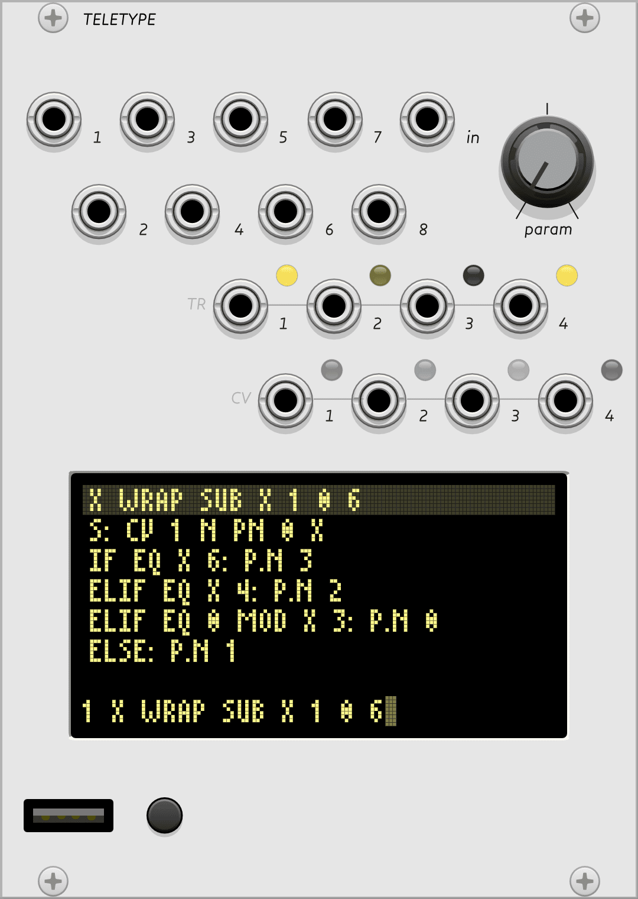

##

{: style="margin: 0em 2em 1.5em 0em; width: 28.5em; height: auto;"}

## Teletype

Teletype is a generative scripting system and sequencing toolkit designed for livecoding and musical exploration. It can serve lots of roles in a patch including a simple tracker-style sequencer, a random gate processor, or a development platform for complex grid-enabled applications. It can be the brain of your entire patch, or it can just provide some custom utility glue.

# Modes, Scripts, and OPs

Teletype has three main modes: [LIVE](http://monome.org/docs/teletype/manual/#live-mode) mode, where commands are executed immediately, [EDIT](http://monome.org/docs/teletype/manual/#edit-mode) mode, where code is assembled into stored scripts, and [TRACKER](http://monome.org/docs/teletype/manual/#patterns) mode, where pattern data can be edited visually. Pressing the **TAB** key will cycle between these three main modes. 

Scripts can be simple or intricate, but there are just ten of them, and each one is only six lines long. Scripts `1-8` are triggered by the eight trigger inputs. The ninth script, `M` for metronome, is triggered by the internal clock, and the tenth `I` script runs when a preset is loaded. Scripts can also be triggered by **F1-F10** on the keyboard, or with a connected grid. Scripts can also trigger other scripts with the `SCRIPT n` operator.

Scripts are made up of operators or [OPs](http://monome.org/docs/teletype/manual/#ops-and-mods). *OPs* may have one or more arguments that could be  numbers or the outputs of other OPs. OPs and values are combined in [prefix notation](https://en.wikipedia.org/wiki/Polish_notation). Hit **Alt-H** (**Option-H** on Mac) on the keyboard to enter **HELP** mode, an on-device reference for OPs and their arguments.

When you enter a line of code, if Teletype can't understood the code, it won't be executed (in **LIVE** mode) or it won't be saved in a script (in **EDIT** mode). The design philosophy of Teletype is that code never produces runtime errors.

# Using the keyboard

To send keyboard input to Teletype, click the screen with your mouse or trackpad. A highlight ring will be drawn around the screen to indicate keyboard focus. Keystrokes will go into Teletype instead of Rack until you click away to un-focus the screen. 

Note that your operating system may intercept some keyboard combinations (like Alt-Esc.) If that happens, Alt-Esc and some other key combinations can also be triggered via the right-click menu.

The VCV Rack version of Teletype defers keycode processing to the firmware, so unfortunately, like the hardware, it currently only supports US QWERTY keyboard layouts. Other layouts will produce unexpected, but consistent results.

# TRIGGER inputs

...

# IN jack & PARAM knob

...

# TR 1-4 outputs

...

# CV 1-4 outputs

...

# PRESET key

...

# Teletype and grids

...

# Quickstart

...

# Further reading

* Teletype [hardware documentation](http://monome.org/docs/teletype/)
* Teletype manual [on the web](https://monome.org/docs/teletype/manual) and [in PDF format](https://monome.org/docs/teletype/manual.pdf)
* Printable Teletype [command cheat sheet](https://monome.org/docs/teletype/TT_commands_4.0.pdf)
* [Teletype Studies](https://monome.org/docs/teletype/studies-1/)
* [A user's guide to the wonderful world of teletype](https://llllllll.co/t/a-users-guide-to-the-wonderful-world-of-teletype/35971)
* ["teletype" search on llllllll.co](https://llllllll.co/search?q=teletype)

# Video tutorials

* [VCV Rack Teletype tutorial by Jakub Ciupinski](https://www.youtube.com/watch?v=AMldf2W0mUw)
* [VCV Rack Teletype Microtutorials by Obakegaku](https://youtube.com/playlist?list=PLt9Y2vOdxouMOWfxDrgVIY0hMZvFCSBw7) and [patch files](https://patchstorage.com/author/obakegaku/)
* ["Teletype Talk" series by Joe Filbrun](https://www.youtube.com/watch?v=mMAhjRKrpZE&list=PLoxHBVkj2rip4Ce4kxdz_k7mK9Z8Wygo-)
* [Teletype videos by The Ghost Saboteur](https://www.youtube.com/playlist?list=PLMHhQKTYXU657VGx48aj-0rs_tjoz7-Eo)
* [Teletype & generative 201](https://www.youtube.com/watch?v=cVHhZkG-pck) from mcpm - [slides and code](https://docs.google.com/presentation/d/1NpNET1D4FlF4zljdo58_u29eLRYLV7yAbxGCsyR12hA/edit#slide=id.gf9647da6be_0_189)

