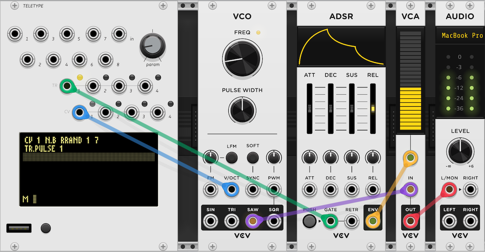

##

{: class="module-image-eighteenhp" }

## Teletype

Teletype is a generative scripting system and sequencing toolkit designed for live coding and musical exploration. It can serve lots of roles in a patch including a simple tracker-style sequencer, a random gate processor, or a development platform for complex grid-enabled applications. It can be the brain of your entire patch, or it can just provide some custom utility glue.

# Modes, Scripts, and OPs

Teletype has three main modes: [LIVE](http://monome.org/docs/teletype/manual/#live-mode) mode, where commands are executed immediately, [EDIT](http://monome.org/docs/teletype/manual/#edit-mode) mode, where code is assembled into stored scripts, and [TRACKER](http://monome.org/docs/teletype/manual/#patterns) mode, where pattern data can be edited visually. Pressing the <kbd>TAB</kbd> key will cycle between these three main modes. 

Scripts can be simple or intricate, but there are just ten of them, and each one is only six lines long. Scripts `1-8` are triggered by the eight trigger inputs. The ninth script, `M` for metronome, is triggered by the internal clock, and the tenth `I` script runs when a preset is loaded. Scripts can also be triggered by <kbd>F1-F10</kbd> on the keyboard, or with a connected grid. Scripts can also trigger other scripts with the `SCRIPT n` operator.

Scripts are made up of operators or [OPs](http://monome.org/docs/teletype/manual/#ops-and-mods). *OPs* may have one or more arguments that could be  numbers or the outputs of other OPs. OPs and values are combined in [prefix notation](https://en.wikipedia.org/wiki/Polish_notation). Hit <kbd>Alt-H</kbd> (<kbd>Option-H</kbd> on Mac) on the keyboard to enter **HELP** mode, an on-device reference for OPs and their arguments.

# Using the keyboard

To send keyboard input to Teletype, click the screen with your mouse or trackpad. A highlight ring will be drawn around the screen to indicate keyboard focus. Keystrokes will go into Teletype instead of Rack until you click away to un-focus the screen. 

Note that your operating system may intercept some keyboard combinations (like <kbd>Alt-Esc</kbd> to enter **SCENE WRITE** mode). If that happens, <kbd>Alt-Esc</kbd> and other critical key combinations can also be triggered via the right-click menu.

The VCV Rack version of Teletype defers keycode processing to the firmware, so unfortunately, like the hardware, it currently only supports US QWERTY keyboard layouts. 

# TRIGGER inputs

Each trigger input **1-8** across the top of the module corresponds to scripts `1-8`. These respond to rising edges of voltage greater than 2.21 V, as outlined in the [Voltage Standards](../../general/voltage/). 

# IN jack & PARAM knob

The **IN** jack and **PARAM** knob can be used to set and replace values. Each returns a value in the range 0-16383, representing 0 V to 10 V. See [the Teletype manual](https://monome.org/docs/teletype/manual/#hardware/) for more information.

The value at **IN** can be queried using the `IN` operator.  
The value of the **PARAM** knob can be queried using the `PARAM` operator (or `PRM` for short.)

# TR 1-4 outputs

Teletype has four trigger/gate outputs, **TR 1-4**. TR outputs are 0 V low, 10 V high. The `TR` operators in the [the Hardware section](https://monome.org/docs/teletype/manual/#hardware/) interact with the trigger outputs. 

# CV 1-4 outputs

Teletype has four CV outputs, **CV 1-4**. CV outputs are 0 V low, 10 V high. The `CV` operators in the [the Hardware section](https://monome.org/docs/teletype/manual/#hardware/) interact with the CV outputs. 

# Saving, loading, and the SCENE key

A *scene* is a complete set of scripts and patterns. The physical module can save up to 32 scenes to its flash memory, and can import and export scenes from a USB drive. The VCV Rack version will save both the current working memory of Teletype *and* up to 32 scenes in your patch. 

To write a scene, press <kbd>Alt + Esc</kbd> (<kbd>Option + Esc</kbd> on Mac) or right-click Teletype and choose "SCENE WRITE mode". Use the bracket keys (`[` and `]`) on your keyboard to select the destination save position. Title and describe your scene, then press <kbd>Alt + Esc</kbd> (<kbd>Option + Esc</kbd> on Mac) to store it. You can write up to 32 scenes in any one virtual instance of Teletype.

You can also save the entire module state -- the active scene and all saved scenes -- for future recall, using VCV Rack's general Preset system. Right-click the Teletype module and navigate to *Preset > Save as*. This will save everything about this copy of Teletype as a single preset file under `Rack 2 > presets > monome > teletype`.

To recall a preset, right-click the Teletype module and navigate to *Preset*. You'll see your saved presets under *User presets*. The **SCENE** key at the bottom of the module allows you to quickly access the scenes stored within the loaded preset.

You can also save and load scenes as text files, which can be transferred in and out of physical Teletype modules. Right-click Teletype and you'll see *Import scenes* and *Export scenes*. These will import and export standard `.txt` files, same as those seen in the [Teletype Code Exchange](https://llllllll.co/t/teletype-code-exchange/839). From this menu you can also copy and paste scenes from the clipboard (including partial scene fragments.)

See [the Teletype manual](https://monome.org/docs/teletype/manual/#scenes) for more information about scenes.


# Quickstart 1

This quickstart example uses Teletype alongside modules from VCV's [Free collection](https://vcvrack.com/Free).
We'll use Teletype's internally-clocked `M` script and as little typing as possible to start sequencing some notes.

{: class="patch-image" }
*uses: Teletype, VCO, ADSR, VCA, AUDIO*

[teletype-quickstart-1.vcv](../patches/teletype-quickstart-1.vcv){: class="patch-download-link" }

- Patch Teletype's **CV 1** output to the VCO's V/8 input
- Patch Teletype's **TR 1** output to the ADSR's GATE input
- Patch the SAW output of the VCO to the audio input of the VCA
- Patch the ADSR's ENV output to the CV input of the VCA 
- Patch the VCA output to the L/MON input of the AUDIO module
- Turn down the VCO Freq knob to 32.703 Hz (or right-click the knob and type `C1`).
- Now, click on the Teletype screen. You should see a highlight ring appear around it, signaling that Teletype has keyboard focus.
- Hit <key>TAB</key> until you are in EDIT mode (there will be a script number in the lower left-hand corner) or right-click Teletype and choose `EDIT MODE`.
- Hit the <key>[</key> and <key>]</key> keys until the `M` script is visible (it will be empty.) 
- Enter the command `CV 1 N.B RRAND 1 7` and hit Enter. That line should now appear as the first line of the `M` script.
- Enter a second command `TR.PULSE 1` and hit Enter. That line should now appear as the second line of the `M` script.

At this point you should start to hear notes coming out, once per second, which is the default period of the metronome that triggers `M`. The first line is selecting a random note from the C Major scale and sending it out as a V/oct pitch value on CV 1. The second line is triggers a short pulse on the TR 1 output.

To add some variety, add a third script line: `PROB 20: CV.OFF 1 V RRAND 0 3` to randomly switch octaves.

To make the clock speed controllable with the *PARAM* knob, try adding the following lines:
```
PARAM.SCALE 60 240
M BPM PARAM
TR.TIME / M 2
```

The first line tells Teletype to interpret the *PARAM* knob as ranging from 60 to 240. The second line sets the new `M` period to a value that would result in the BPM specified by the `PARAM` value. The third line sets the TR pulse time to one-half the clock period so the notes scale with the clock rather than running together.

# Quickstart 2

This quickstart example uses Teletype alongside modules from VCV's [Free collection](https://vcvrack.com/Free). In addition to using Teletype's internal clock, we'll also trigger scripts with external input to sequence exciting changes to our patch. [Meadowphysics](../meadowphysics) was originally designed as a script-triggering companion to Teletype, so that's exactly what we'll use it to do.

{: class="patch-image" }
*uses: Meadowphysics, Teletype, grid (optional), VCO (2x), ADSR (2x), VCA MIX, AUDIO*

[teletype-quickstart-2.vcv](../patches/teletype-quickstart-2.vcv){: class="patch-download-link" }

- Load the `TRIANGLE MOUNTAIN` factory preset by right-clicking Teletype and hovering over the *Preset* submenu, then clicking `TRIANGLE MOUNTAIN`.
- Patch **CV 1** to the first VCO's V/8 input, and **CV 2** to the other's
- Patch **TR 1** to the first ADSR's GATE input, and **TR 2** to the other's
- Patch the TRI output of the first VCO to the first input of VCA MIX
- Patch the SAW output of the second VCO to the second input of VCA MIX
- Patch the first ADSR's ENV to CV 1 of VCA MIX
- Patch the second ADSR's ENV to CV 2 of VCA MIX

If all went well, you'll start hearing a cycling arpeggio from the first VCO. Experiment with patching outputs from Meadowphysics into each of Teletype's eight trigger inputs. We recommend starting with trigger input `5` to get a sequence going on the second VCO, then explore from there! Be sure to play with running Meadowphysics and Teletype at different rates, with the *CLOCK* knob on Meadowphysics and the *PARAM* knob on Teletype.

Click the Teletype screen and hit <key>Tab</key> to look at the pattern values in TRACKER mode and the scripts in EDIT mode. The TRIANGLE MOUNTAIN scene demonstrates several Teletype features, including the `P` [pattern ops](https://monome.org/docs/teletype/manual/#patterns-1), the `S` [stack ops](https://monome.org/docs/teletype/manual/#stack), and the [preconditions](https://monome.org/docs/teletype/manual/#control-flow) `IF:`, `ELSE:` and `L:` (for Loop).


# Teletype and grids

Unlike the other modules in this collection, Teletype can be used close to fully without a grid controller. But it does have two optional ways to interact with a connected grid.

The first is "Grid Control Mode" which is always available, without special scripting. Connect a grid and press the `PRESET` button twice to enable grid control mode. It will only take up an 8x8 section of the grid, so on larger grids the rest of the grid will show whatever the scene has scripted (or nothing.) From the grid control mode interface, you can jump to scripts in the editor, toggle and mute them, edit patterns, mute individual lines of code, and manage scenes. See the [GRID INTEGRATION guide section on Grid Control Mode](https://github.com/scanner-darkly/teletype/wiki/GRID-CONTROL-MODE) for the details.

The second way to interact with grids is to script your own interface. The `G` series of operators allow creating scenes that can light up individual LEDs, draw shapes, and create controls (such as buttons and faders) that can be used to trigger and control scripts. 

For the basics, see [the Teletype manual](https://monome.org/docs/teletype/manual/#grid).

For advanced scripting techniques, see `@scanner-darkly`'s [GRID INTEGRATION studies](https://github.com/scanner-darkly/teletype/wiki/GRID-INTEGRATION).

You can use either a physical or virtual grid to take advantage of the grid operators or Grid Control Mode. Hardware versions of Teletype can't use both the grid and the keyboard at the same time, and there are [some precautions to follow](https://monome.org/docs/grid/grid-modular/#teletype) regarding power loads, but thankfully the software version has none of these restrictions, making it an excellent environment for developing complex grid scenes that you can later transfer to hardware.

# Further reading

* Teletype [hardware documentation](http://monome.org/docs/teletype/)
* Teletype manual [on the web](https://monome.org/docs/teletype/manual) and [in PDF format](https://monome.org/docs/teletype/manual.pdf)
* Printable Teletype [command cheat sheet](https://monome.org/docs/teletype/TT_commands_4.0.pdf)
* [Teletype Studies](https://monome.org/docs/teletype/studies-1/)
* [A user's guide to the wonderful world of teletype](https://llllllll.co/t/a-users-guide-to-the-wonderful-world-of-teletype/35971)
* [Teletype workflow, basics, and questions](https://llllllll.co/t/teletype-workflow-basics-and-questions/12392)
* [Teletype code exchange](https://llllllll.co/t/teletype-code-exchange/839)
* [Teletype grid integration](https://github.com/scanner-darkly/teletype/wiki/GRID-INTEGRATION)
* ["teletype" search on llllllll.co](https://llllllll.co/search?q=teletype)

# Video tutorials

* [VCV Rack Teletype tutorial by Jakub Ciupinski](https://www.youtube.com/watch?v=AMldf2W0mUw)
* [VCV Rack Teletype Microtutorials by Obakegaku](https://youtube.com/playlist?list=PLt9Y2vOdxouMOWfxDrgVIY0hMZvFCSBw7) and [patch files](https://patchstorage.com/author/obakegaku/)
* ["Teletype Talk" series by Joe Filbrun](https://www.youtube.com/watch?v=mMAhjRKrpZE&list=PLoxHBVkj2rip4Ce4kxdz_k7mK9Z8Wygo-)
* [Teletype videos by The Ghost Saboteur](https://www.youtube.com/playlist?list=PLMHhQKTYXU657VGx48aj-0rs_tjoz7-Eo)
* [Teletype & generative 201](https://www.youtube.com/watch?v=cVHhZkG-pck) from mcpm - [slides and code](https://docs.google.com/presentation/d/1NpNET1D4FlF4zljdo58_u29eLRYLV7yAbxGCsyR12hA/edit#slide=id.gf9647da6be_0_189)

