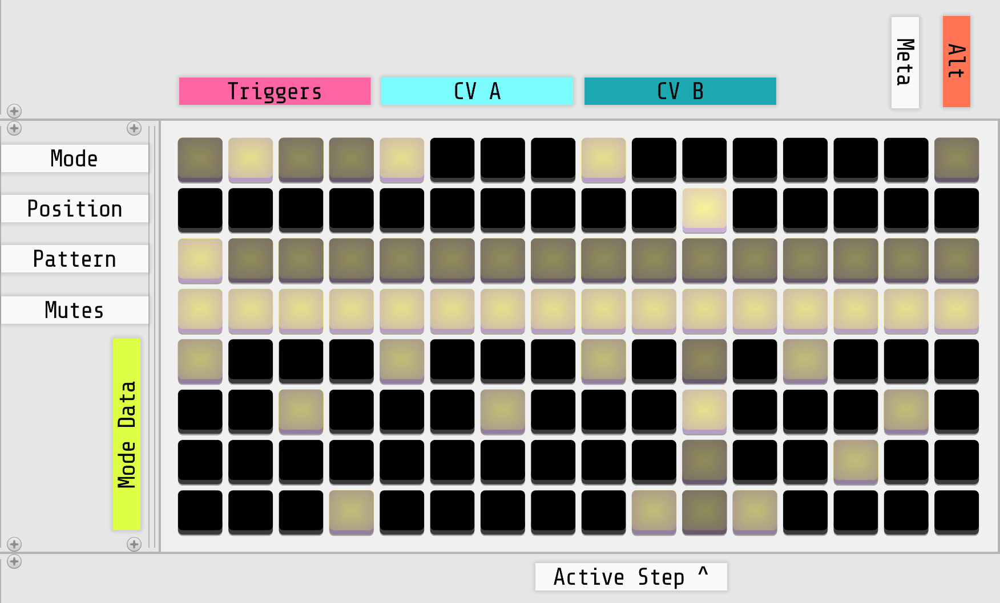
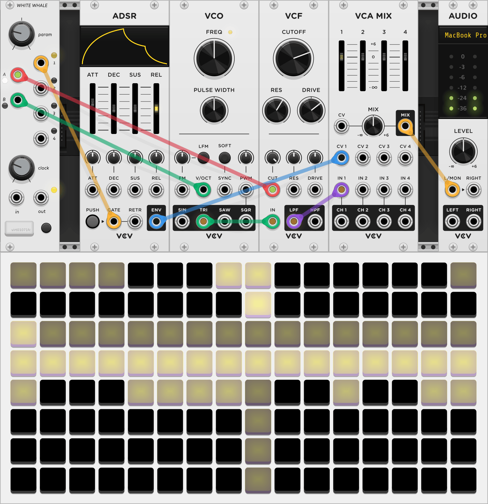

{: class="module-image-sixhp" }

## White Whale

White Whale, [connected to a grid controller](../../general/connections), is a live probabilistic step sequencer. It is the culmination of methods and experiments based on a decade of step sequencer design for the grid.

Without a grid connection it will not produce any output besides a clock, but once a sequence has been entered, you can disconnect the grid and the sequence will continue playing.

[Read the introduction to the hardware module](http://monome.org/docs/whitewhale/#introduction).

# CV A-B & TR 1-4 outputs

White Whale produces two continuous CV outputs on **CV A** and **CV B** on the left side of the module and four trigger/gate outputs from **TR 1-4** on the right side. CV outputs range from 0 V to 10 V and TR outputs are 0 V low, 8 V high.

CV's are quantized to the nearest semitone by default, for easier melodic tuning. They can also be un-quantized in conjunction with the **PARAM** knob [as described in the hardware docs](https://monome.org/docs/whitewhale/#cv-map).

Triggers may be swapped for gates by entering [gate mode](https://monome.org/docs/whitewhale/#gate-mode).

# CLOCK knob & jacks

The **CLOCK** knob controls the timing of clock pulses that drive the four triggers and two CV values. The knob ranges from a period of 2 second to a period of 47ms. Patching a signal into **CLOCK IN** will override the timing and [every low/high transition](../../general/voltage/#inputs) on the input will pulse the counters. (Very fast clocks approaching a 1ms period may result in skipped pulses; the module will not go into audio rate.) The pulse width of the clock in sets the trigger time for individual trigger outs. The sequencer can be stopped altogether by inserting an unconnected patch cable to clock in.

The **CLOCK OUT** jack sends a gate signal out according to the current clock following the internal or external clock as appropriate. This output is ideal for linking multiple sequencers, or for a regular rhythmic pulse in your system.

# PARAM knob

A multi-purpose control which changes its mode depending on the grid interface:

{: style="width: 40em;"}

Change CV values while in the *CV A* or *CV B* region by either:

- pressing any pad in the bottom 4 rows to set that step's CV value to the **PARAM** knob's position
- holding any one pad in the bottom 4 rows and using **PARAM** to adjust that step's CV value
- holding ALT and the bottom-right key to live-record the **PARAM** knob's value to each step in realtime
  - note: values overwrite as soon as you hold the ALT + bottom-right key combo

Change scale values while in the *CV A* or *CV B* region by entering the [CV Map](https://monome.org/docs/whitewhale/#cv-map):

- [modify the scale maps](https://monome.org/docs/whitewhale/#modifying-scale-maps) by selecting a scale tone on the bottom row
- hold *ALT* and the bottom-right grid key
- set the value with the **PARAM** knob

Change the CV randomization range by entering the *CV A* or *CV B* region:

- hold a step's *center* key (located two rows above the bottom row)
- set the maximum possible random value with the **PARAM** knob
- while holding the *center* key press the key in bottom row to generate a random value  
- the above is similar for [channel transposition](https://monome.org/docs/whitewhale/#channel-transpose)

Hold *ALT* and press *META* to enter [Series Mode](https://monome.org/docs/whitewhale/#series-mode):

- hold *META* to use the **PARAM** knob to scroll the view

# Quickstart

This quickstart example uses White Whale alongside modules from VCV's [Fundamental collection](https://vcvrack.com/Fundamental).

{: style="width: 40em;"}
*uses: White Whale, ADSR, VCO, VCF, VCA MIX, AUDIO*

- Connect White Whale to a grid
- Patch White Whale's **TR 1** to ADSR's GATE input
- Patch VCO's TRI output to VCF's IN
- Patch VCF's LPF output to IN 1 of VCA MIX
- Patch ADSR's ENV output to CV 1 of VCA MIX
- Patch VCA MIX's MIX output to AUDIO's L input
- Create a sequence of triggers on White Whale's first channel to open the envelope
- Patch White Whale's **CV A** to VCF's CUT input and add modulation using the attenuator above the input
- Change VCF's CUTOFF and RES to hear **CV A**'s affect
- Enter the **CV A** region on grid and use the **PARAM** knob to enter CV values for a few steps
- Hold *ALT* on the grid and enter the **CV B** region on grid -- this will show put **CV B** into a [Scale Map](https://monome.org/docs/whitewhale/#cv-map), which quantizes **CV B**'s output to a musical note range
- As the pattern plays, enter new notes for each step in the *Scale Map*

# Further reading

* White Whale [hardware documentation](http://monome.org/docs/whitewhale/)
* ["white whale" search on llllllll.co](https://llllllll.co/search?q=white%20whale)

# Video tutorials

* [white whale possibilities](https://vimeo.com/104881064)
* [white whale tutorial part 1](https://vimeo.com/105368808)
* [white whale tutorial part 2](https://vimeo.com/105368874)
* [white whale tutorial part 3](https://vimeo.com/105408057)
* [white whale tutorial part 4](https://vimeo.com/105408747)
