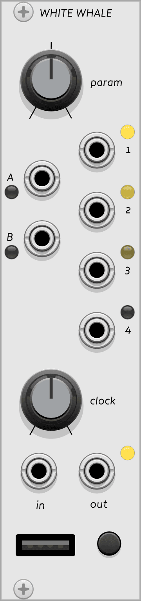

{: class="module-image-sixhp" }

## White Whale

White Whale, [connected to a grid controller](../../general/connections), is a live probabilistic step sequencer. It is the culmination of methods and experiments based on a decade of step sequencer design for the grid.

Without a grid connection it will not produce any output besides a clock, but once a sequence has been entered, you can disconnect the grid and the sequence will continue playing.

[Read the introduction to the hardware module](http://monome.org/docs/whitewhale/#introduction).

# CV A-B & TR 1-4 outputs

White Whale produces two continuous CV outputs on **CV A** and **CV B** on the left side of the module and four trigger/gate outputs from **TR 1-4** on the right side. CV outputs range from 0 V to 10 V and TR outputs are 0 V low, 8 V high.

CV's are quantized to the nearest semitone by default, for easier melodic tuning. They can also be un-quantized in conjunction with the **PARAM** knob [as described in the hardware docs](https://monome.org/docs/whitewhale/#cv-map).

Triggers may be swapped for gates by entering [gate mode](https://monome.org/docs/whitewhale/#gate-mode).

# CLOCK knob & jacks

The **CLOCK** knob controls the timing of clock pulses that drive the four triggers and two CV values. The knob ranges from a period of 2 second to a period of 47ms. Patching a signal into **CLOCK IN** will override the timing and [every low/high transition](../../general/voltage/#inputs) on the input will pulse the counters. (Very fast clocks approaching a 1ms period may result in skipped pulses; the module will not go into audio rate.) The pulse width of the clock in sets the trigger time for individual trigger outs. The sequencer can be stopped altogether by inserting an unconnected patch cable to clock in.

The **CLOCK OUT** jack sends a gate signal out according to the current clock following the internal or external clock as appropriate. This output is ideal for linking multiple sequencers, or for a regular rhythmic pulse in your system.

# PARAM knob

A multi-purpose control which changes its mode depending on the grid interface. Generally, if there is a continuous value represented by a grid key or row, holding that key and turning *PARAM* will allow you to edit it.

# Grid reference

{: class="patch-image" }

[whitewhale-grid-legend.vcv](../patches/whitewhale-grid-legend.vcv){: class="patch-download-link" } *(requires [Stoermelder Glue](https://library.vcvrack.com/Stoermelder-P1))*

Pressing a key in the first row will swap between three data views: the *TR 1-4* trigger outs, the *CV A* output, or the *CV B* output. In the Triggers view, pressing a key will turn the gate on or off for that step.

The *CV A & B* modes are more complex. They can either be in [Curves](http://monome.org/docs/whitewhale/#cv-curves) mode for unquantized outputs, or [CV Map](http://monome.org/docs/whitewhale/#cv-map) mode for outputs quantized to a scale. 

In the default [Curves](http://monome.org/docs/whitewhale/#cv-curves) mode, you can change CV values while in the *CV A* or *CV B* region by either:

- pressing any pad in the bottom 4 rows to set that step's CV value to the **PARAM** knob's position
- holding any one pad in the bottom 4 rows and using **PARAM** to adjust that step's CV value
- holding ALT and the bottom-right key to live-record the **PARAM** knob's value to each step in realtime
  - note: values overwrite as soon as you hold the ALT + bottom-right key combo

In [CV Map](http://monome.org/docs/whitewhale/#cv-map) mode, you can change CV values by selecting a step on the fifth row, and selecting one of the 16 values in the map on the bottom row.

# Quickstart

This quickstart example uses White Whale alongside modules from VCV's [Free collection](https://vcvrack.com/Free).

{: class="patch-image" }
*uses: White Whale, ADSR, VCO, VCF, VCA MIX, AUDIO*

[whitewhale-quickstart.vcv](../patches/whitewhale-quickstart.vcv){: class="patch-download-link" }

- Connect White Whale to a grid (See [Making Connections](../../general/connections/#making-connections).)
- Patch White Whale's **TR 1** to ADSR's GATE input.
- Patch VCO's TRI output to VCF's IN.
- Patch VCF's LPF output to IN 1 of VCA MIX.
- Patch ADSR's ENV output to CV 1 of VCA MIX.
- Patch VCA MIX's MIX output to AUDIO's L input.
- Create a sequence of triggers on White Whale's first channel to open the envelope.
- Patch White Whale's **CV A** to VCF's CUT input and add modulation using the attenuator above the input (you won't hear changes yet.)
- Enter the **CV A** region on grid by pressing the fourth key in the top row. Now enter CV values for a few steps by holding a key on the bottom row and turning the **PARAM** knob.
- Adjust VCF's CUTOFF and RES to hear **CV A**'s affect.
- Hold *ALT* on the grid and enter the **CV B** region on grid -- this will show put **CV B** into a [Scale Map](https://monome.org/docs/whitewhale/#cv-map), which quantizes **CV B**'s output to a musical note range.
- As the pattern plays, enter new notes for each step in the *Scale Map*.

# Alternate firmware

Choose **Firmware Tools > Switch Firmware** to see alternate firmware options for White Whale.

White Whale offers the standard firmware plus the Kria alternate firmware, an early form of the Kria sequencer mode in Ansible. [Read about the original version of Kria here](https://llllllll.co/t/kria-0-3-initial-release/2409).

# Further reading

* White Whale [hardware documentation](http://monome.org/docs/whitewhale/)
* ["white whale" search on llllllll.co](https://llllllll.co/search?q=white%20whale)

# Video tutorials

* [white whale possibilities](https://vimeo.com/104881064)
* [white whale tutorial part 1](https://vimeo.com/105368808)
* [white whale tutorial part 2](https://vimeo.com/105368874)
* [white whale tutorial part 3](https://vimeo.com/105408057)
* [white whale tutorial part 4](https://vimeo.com/105408747)
* [kria demo](https://vimeo.com/152756139)
* [kria lesson](https://vimeo.com/153923660)
